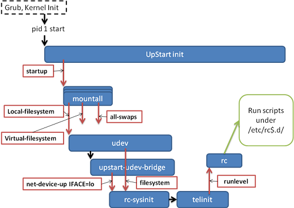

## OS 启动

linux有3种启动方式：System V init，upstart，systemd 

### System V init

内核在加载完毕后,会调用第一个进程,/sbin/init该进程会读取其配置文件/etc/inittab,并按照该配置文件的语法规则解析其中的每一项,完成对应的操作（执行rc.sysinit进行所有runlevel的系统初始化，启动特定level的服务）,实现系统的初始化.

最后执行rc.local运行用户需要在开机时进行的操作。

===

#### 启动相关的文件和目录

其中rc表示run command。.d表示目录

/sbin/init程序是ELF格式的文件，本身完成的是逐项解析/etc/inittab文件并调用相应的脚本完成功能,具体操作的实现由相应的脚本完成.

/etc/inittab说明/sbin/init程序完成的具体操作

/etc/rc.d/rc runlevel（如rc 5）依次执行/etc/rcrunlevel.d目录下的脚本链接文件，启动相应服务

/etc/rcrunlevel.d（如rc5.d）放置对应runlevel下需要启动服务的脚本链接，以及切换runlevel时需要关闭的服务的脚本链接。

/etc/init.d 放置各种服务的脚本，是/etc/rcrunlevel.d目录下链接文件的目的，具体实现服务的启动和关闭功能。

/etc/rc.local是一个脚本文件，用来给用户设置自己需要在开机时进行的系统设置（如调整亮度）和在开机时启动的系统服务或程序（如tmux）

#### /etc/inittab

该配置文件每一行对应一项操作,通过/etc/inittab的语法进行解析.

**语法**

inittab文件中的每一项都是如下格式： 

label:runlevel:action:process 

label:用于说明该项的设置的内容

runlevel:一般用于指明该项对那些runlevel有效。

action:init的操作行为

process:命令选项，即应该进行的命令，通常是一些脚本。

通过上述语法，/etc/inittab一般按顺序规定，系统默认的runlevel，使用/etc/rc.d/rc.sysinit进行系统初始化,各个runlevel特定执行的脚本/etc/rc.d/rc runlevel，ctrl+alt+del的功能，掉电和掉电恢复需要进行工作，启动6个终端机（tty1-tty6),为特定的runlevel设置启动图形界面的选项。

#### run level

运行级别run level是/etc/inittab中的一项重要的设置。决定着启动的linux的使用场合。

Linux预置七种运行级别（0-6）。一般来说，0是关机，1是单用户模式（也就是维护模式），6是重启。运行级别2-5，各个发行版不太一样，对于Debian来说，都是同样的多用户模式（也就是正常模式）。 

#### /etc/rc.d/rc.sysinit

/etc/rc.d/rc.sysinit是一个bash shell的脚本，它主要是完成一些系统初始化的工作，rc.sysinit是每一个运行级别都要首先运行的重要脚本，也即完成所有运行级别都需要进行的初始化工作。它主要完成的工作有：读取网络环境，读取主机类型，决定是否启动SELinux，挂载/proc，挂载USB设备，启动随机数生成器，设置字体、时间，加载用户自定义的模块，使用fsck检查磁盘，以读写模式重新挂载磁盘（开始挂载以只读模式挂载）等。

#### /etc/rc.d/rc runlevel

这个脚本用来执行对应/etc/rcrunlevel.d目录（如/etc/rc5.d）下的启动服务脚本（实际上是一些连接文件，连接到/etc/init.d目录下对应脚本）。

/etc/rcrunlevel.d文件夹下的链接文件中S开头的表示需要启动的服务，K开头的表示需要关闭的服务（在切换run level的时候需要关闭一些服务），链接文件的名称中的数字表示优先级（因为某些服务依赖于先前的服务）。

使用chkconfig处理该目录下的链接文件即可。

### upstart

upstart中，程序执行单位被称作作业(Job)，所有的init作业都必须将其配置文件（配置文件指出作业什么时候start，什么时候stop）放置于目录/etc/init/之下。Upstart启动时，从 /etc/init/ 目录中读取各个Job的配置文件，获取所有Job。然后发出Startup信号，所有监听这个信号的作业会被执行。在作业执行过程中，作业本身也可以自己发出信号，其他监听这个信号的服务接着就会被启动执行。Upstart通过这样的方式来达到异步和实时控制作业的启动执行。

基于事件的 Upstart 是 /sbin/init 守护进程的替代品，它仅为在需要那些服务的时候启动服务而生，

在Upstart之下，你可以有2种方式添加系统服务程序： 

按照System V 规则编写服务，并置于相应位置。 

编写Upstart作业配置文件，置于 /etc/init/ 目录之下。

#### upstart工作流程

#### upstart兼容sysvinit

由于很多软件包中都包含了sysv的启动脚本,为了兼容这部分程序,upstart提供了兼容机制.在/etc/init/下有rc-sysinit和rc作业,其运行机制是:作业rc-sysinit在收到 “(filesystem and static-network-up) or failsafe-boot” 的信号之后由Upstart启动。一切正常的话，rc-sysinit通过telinit完成运行级别信号的发送。作业rc在收到运行级别信号之后，由Upstart启动。然后rc通过运行/etc/init.d/rc $RUNLEVEL这个命令， 来完成/etc/rcN.d/下相应程序的启动。 

这样，就完成了兼容sysvinit的过程。

